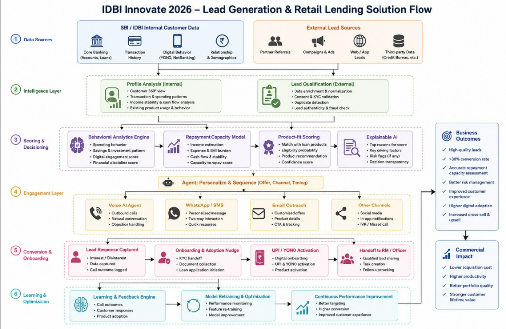

# Tara Intelligence Engine — Lead Generation & Retail Lending Solution

Tara is an enterprise-grade Customer 360 Intelligence and Automated Engagement Platform designed for retail lending. It integrates multi-source core banking data with external lead pipelines to deliver real-time machine learning predictions, Explainable AI insights, and multi-channel automated outreach (Voice AI, WhatsApp, SMS, and Email).

## 🏗️ Architecture & Solution Flow

Here is the end-to-end architecture and solution flow of the Tara platform:




## 🌟 Key Features

1. **Unified Customer 360 View**: Merges Core Banking, Transaction History, Digital Activity, and Loan records into a single dashboard.
2. **Real-time ML Scoring**:
   * **Repayment Capacity**: Predicts capacity (High/Medium/Low) based on cash flow and debt obligations.
   * **Product-fit Recommendation**: Recommends the optimal retail loan product.
   * **Conversion Probability**: Models customer interest to prioritize high-value prospects.
3. **Explainable AI (XAI)**: Generates clear, non-jargon reason codes and mathematical summaries for auditing and client-facing transparency.
4. **Agent-driven Multi-channel Outreach**:
   * **Automated Voice AI**: Twilio-powered conversational voice agent with live call transcripts.
   * **Personalized WhatsApp/SMS**: Dynamic outreach copy tailored to the customer's score parameters.
   * **Email Campaigns**: Interactive emails with call-to-action tracking.
5. **Relationship Manager (RM) Handoff**: Instantly assigns hot leads to physical RMs for high-touch onboarding.

---

## 💻 Tech Stack

### Backend
* **Core**: Python, FastAPI
* **Database**: MongoDB / Azure Cosmos DB (MongoDB API)
* **AI/LLM**: OpenAI GPT-4o / Azure OpenAI (fallback)
* **Outreach Integrations**: Twilio (Voice, SMS, WhatsApp), SendGrid & SMTP (Email)

### Frontend
* **Core**: React, Vite
* **Styling**: Vanilla CSS, Tailwind CSS
* **Icons**: Lucide React

---

## 🚀 Setup & Execution

### Prerequisites
* Python 3.10+
* Node.js 18+
* MongoDB Instance (or Cosmos DB connection string)

### 1. Backend Setup
1. Navigate to the `backend` directory:
   ```bash
   cd backend
   ```
2. Create and activate a virtual environment:
   ```bash
   python -m venv .venv
   # Windows:
   .venv\Scripts\activate
   # macOS/Linux:
   source .venv/bin/activate
   ```
3. Install dependencies:
   ```bash
   pip install -r requirements.txt
   ```
4. Create a `.env` file in the `backend` folder based on `.env.example` and add your database and API keys.
5. Start the server:
   ```bash
   uvicorn app.main:app --reload
   ```
   *The backend will be running at `http://localhost:8000`.*

### 2. Frontend Setup
1. Navigate to the `frontend` directory:
   ```bash
   cd ../frontend
   ```
2. Install Node packages:
   ```bash
   npm install
   ```
3. Start the development server:
   ```bash
   npm run dev
   ```
   *The frontend application will be running at `http://localhost:5173`.*
